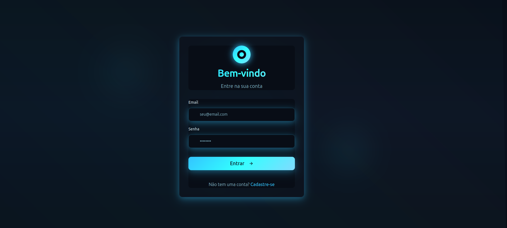
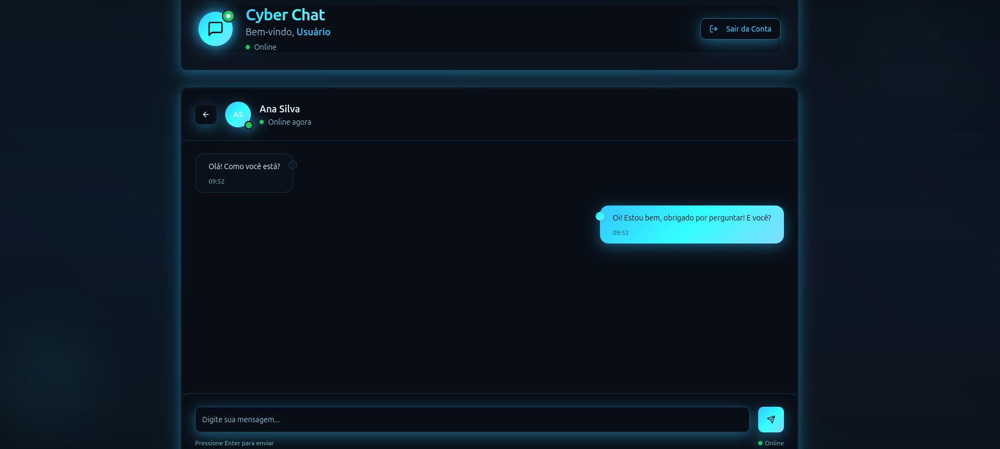

# 💬 Cyber Chat

Cyber Chat é um sistema de chat **seguro** desenvolvido em **Java** com **Quarkus** no backend, permitindo que usuários se registrem, façam login e troquem mensagens privadas utilizando **criptografia de ponta a ponta**.
A busca de usuários para iniciar conversas é feita utilizando **o e-mail** como identificador único.

---

## 🚀 Tecnologias Utilizadas

* **Java 17+**
* **Quarkus** (RESTEasy, Panache, JWT, WebSockets)
* **PostgreSQL** (armazenamento de usuários e mensagens)
* **JWT** (autenticação segura)
* **WebSockets** (mensagens em tempo real)
* **Criptografia de ponta a ponta** (E2EE)

---

## 📸 Demonstração

### Tela de Login

### Tela do Chat

### Tela da Home

---

